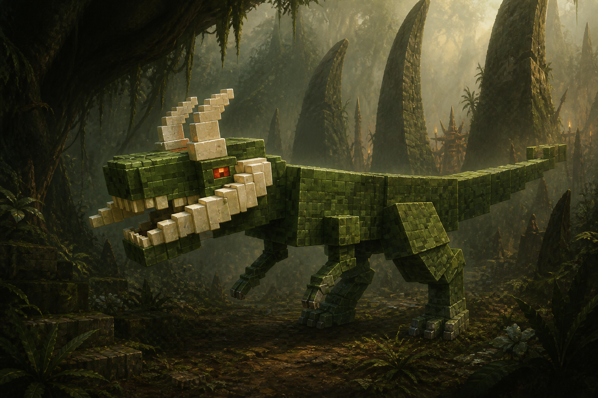
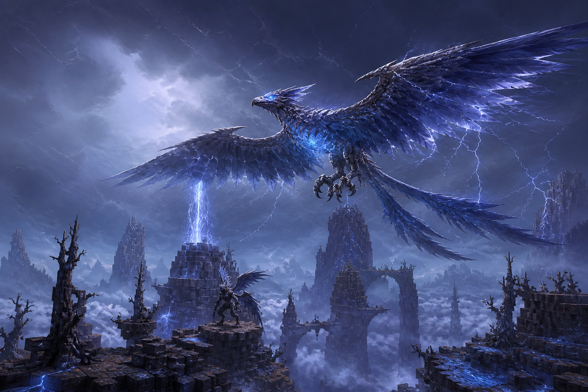
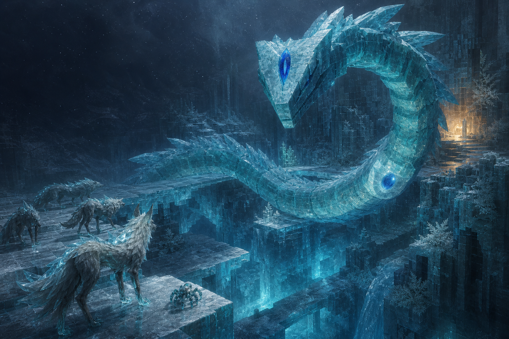
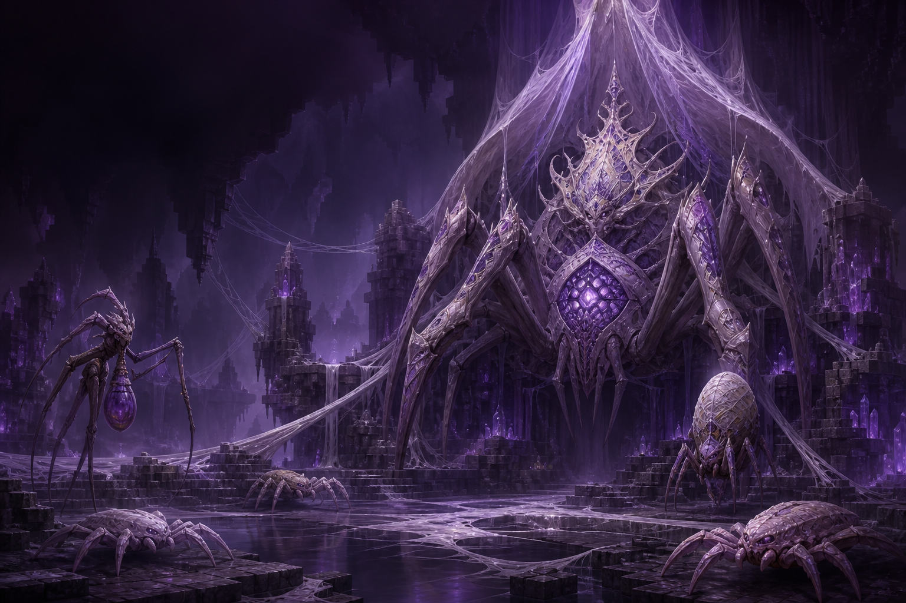
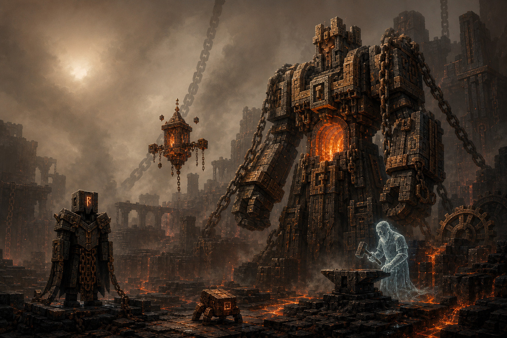
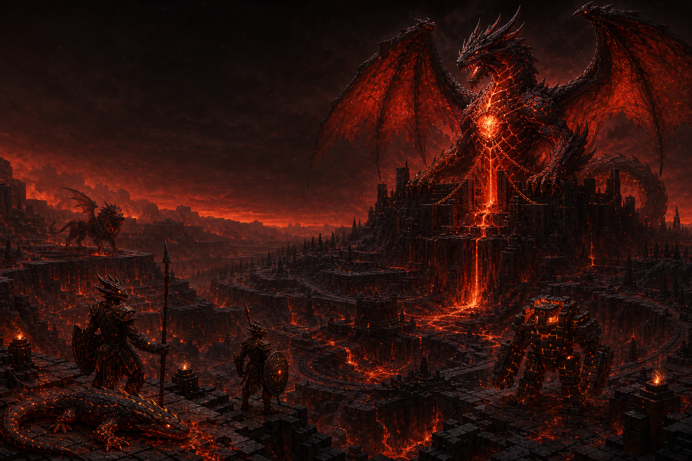

# Бестиарий земель Первоклыка

## Предисловие

Этот бестиарий собран не для счетоводов и не для оружейников. В нем нет мер силы, перечней приемов и наставлений о том, как одолеть чудовище. Это книга дорог: о землях, которые меняют своих обитателей, о народах, научившихся жить рядом с древними хозяевами, и о существах, чьи имена стали частью самого пейзажа.

Путь начинается в Джунглях Каменного Клыка. Там живет Тарр-Горак Первоклык, первый из великих зверей, которого встречают молодые странники. Он ближе остальных к привычному миру: смертен, голоден и понятен в своей звериной ярости. Но даже его след ведет в прошлое, старше лагерей кхарров и старше деревьев, растущих над их тропами.

Дальше дорога поднимается над облаками, уходит под лед, спускается в шелковую тьму, пересекает мертвый город кузниц и заканчивается у вулкана, который дышит вместе с драконом. Каждая глава устроена одинаково: сначала земля, затем ее жители, и лишь после них тот, кому эта земля уступила свое имя.

## Содержание

1. Джунгли Каменного Клыка: Тарр-Горак Первоклык
2. Грозовые Пики: Аэр-Роан Грозокрыл
3. Ледяной Разлом: Саарглас Ледяной Змей
4. Шелковые Глубины: Иззара Мать Шелка
5. Расколотое Нагорье: Ор-Хадар Древняя Кузня
6. Пепельная Кальдера: Варзахан Багровый Дракон

## 1. Тарр-Горак Первоклык

### Биом: Джунгли Каменного Клыка

Сверху эти джунгли кажутся единым темным морем. Два яруса крон почти не пропускают солнце, и даже в полдень под ними лежат длинные зеленые сумерки. Корни старых деревьев выгибаются над землей каменными арками. Между ними стоят серые зубцы, похожие на клыки исполинского зверя, который когда-то уснул под лесом и окаменел.

У земли джунгли разделены на два мира. Первый состоит из сухих охотничьих троп, натертых тысячами лап и ног до красной глины. Второй начинается в нескольких шагах от них: черная грязь, чаши стоячей воды, папоротники выше человека и клубки лиан, способные спрятать целый отряд. Тот, кто сходит с тропы, быстро теряет не только направление, но и чувство времени.

Здесь часто находят ребра древних животных, вросшие в корни. Кхарры украшают такими костями стоянки и метят ими развилки. На ночь они разводят низкие смоляные огни. Их дым не поднимается над листьями и пахнет горькими травами. В темноте лес разговаривает щелчками насекомых, короткими криками птиц и редкими ударами хвоста о древесный ствол.

Дождь приходит внезапно. Он превращает воздух в теплую стену воды, заглушает запахи и стирает свежие следы. Но самые глубокие отпечатки остаются. В них собираются целые лужи, а кхарры никогда не ставят рядом лагерь. Такие следы принадлежат Первоклыку.

### Кто здесь живет

#### Кхарры

Кхарры называют себя теми, кто делит тропу. Это прямостоящие ящеры с костяными украшениями, кожаными перевязями и оружием из камня, дерева и панциря. Они не строят городов. Их домом считается не место, а круг знакомых троп, источников и деревьев, на которых вырезаны знаки стаи. Кхарры суровы к чужакам, но хорошо помнят обещания и не смеются над тем, кто честно признает страх.

#### Тенеклык

Тенеклыки идут впереди охотников. Их чешуя покрыта пятнами цвета мокрой коры, а легкие накидки сплетены из листьев и темных волокон. Они умеют долго стоять неподвижно, слушая лес всем телом. Если путник заметил Тенеклыка, значит, тот уже успел рассмотреть путника и решить, стоит ли звать стаю.

#### Налетчик с клинком

Это основа кхаррской охоты. Налетчики держатся небольшими группами и движутся так, чтобы каждый видел плечо соседа. Их каменные клинки грубы на вид, но тщательно отполированы смолой и песком. После удачной охоты они оставляют на ближайшем стволе косую зарубку, благодаря лес за то, что он позволил им вернуться.

#### Секущий стаю

Самые сильные кхарры носят по два тяжелых каменных топора. Их называют Секущими стаю не потому, что они разрушают ее, а потому, что раскрывают путь сквозь заросли и плоть добычи. Перед охотой они молча касаются лбами рукоятей. На этих рукоятях вырезаны имена погибших товарищей.

#### Щитоносец кхарров

Щиты этих стражей собраны из панциря, коры и густой смолы. Каждый похож на кусок самой лесной земли. Щитоносцы охраняют стоянки, раненых и кладки яиц. Они редко преследуют бегущего врага, поскольку считают, что настоящий долг всегда находится позади их спины.

#### Клыколов

Клыколов похож на небольшого двуногого хищника с широкой пастью и цепкими лапами. Кхарры не считают его домашним зверем. Стая и клыколов просто терпят друг друга, деля остатки добычи и предупреждая друг друга об опасности. Иногда зверь следует за охотниками неделями, а затем без причины исчезает в папоротниках.

#### Вожак Первой Тропы

Вожак носит корону из старых клыков и двуручный топор, которым нельзя пользоваться в тесной чаще. Поэтому он выходит на открытые поляны, где решения стаи становятся видны всем. Вожак знает древние переходы, места весенних разливов и деревья, под которыми нельзя ночевать. Именно он выбирает, когда стая оставит подношение Первоклыку.

### Хозяин биома: Тарр-Горак Первоклык

Тарр-Горак не король кхарров и не прирученный ими зверь. Он последний из древних тирантов, переживший несколько джунглей. Лес вокруг него менялся, реки уходили под землю, а молодые деревья успевали стать гигантами. Первоклык оставался. Его зеленая шкура потемнела, костяные пластины на челюсти побелели, а рога стали похожи на корни, вымытые дождем.

Кхарры дали ему имя после того, как нашли его следы под корнями деревьев, старше любой известной стоянки. Для них он не бог. Он доказательство того, что охота началась раньше памяти и продолжится после того, как нынешние стаи исчезнут. Они оставляют ему туши на дальних тропах, но не ждут благодарности. Голод Тарр-Горака не различает друзей, врагов и неосторожных почитателей.

Обычно его присутствие выдают птицы. Сначала они замолкают, затем разом поднимаются над кронами. После этого земля едва заметно дрожит. Первоклык идет низко, почти касаясь белыми пластинами челюсти папоротников, и выбирает путь с пугающей уверенностью. Его красные глаза замечают движение там, где человеку видится только листва.

В сердце зверя за долгие века срослась россыпь зеленого камня. Кхаррские сказители говорят, что этот камень помнит тяжесть каждого шага и точный миг каждого броска. Возможно, поэтому Тарр-Горак кажется не просто старым хищником. В нем живет память самой погони, терпеливая, безмолвная и никогда не устающая.

## 2. Аэр-Роан Грозокрыл

### Биом: Грозовые Пики

Грозовые Пики поднимаются выше привычных облаков. Их вершины похожи на острова в белом море, а узкие каменные мосты исчезают в тумане уже через несколько шагов. Здесь нет спокойного воздуха. Ветер меняет направление между вдохом и выдохом, подхватывает песок, перья и обрывки ткани, а затем несет их вверх, словно земля внезапно стала небом.

Деревья на плато низкие и черные. Они растут почти горизонтально, прижавшись к камню, и носят на коре следы старых молний. На открытых местах стоят ветвистые столбы фульгурита, стеклянные шрамы, оставленные грозой в песке и скале. Перед бурей они начинают тихо звенеть.

Дождь здесь летит боком. Временами он превращается в мелкую ледяную пыль, которая светится при каждой вспышке. Самое удивительное зрелище открывается ночью: молнии бродят под облачным морем, и путник смотрит на грозу сверху. Кажется, будто под ногами лежит другой мир, освещенный голубым огнем.

Жители Пиков устраивают гнезда и убежища в расщелинах с подветренной стороны. Они знают язык воздушных потоков и чувствуют приближение грозы по металлическому вкусу во рту. Но даже они покидают открытые плато, когда над вершинами появляется длинная неподвижная тень.

### Кто здесь живет

#### Искровой дух

Три светящихся пера вращаются вокруг крошечного сгустка воздуха. Так выглядит Искровой дух, рожденный там, где молния дважды ударила в одно место. Он любопытен и часто следует за путешественниками, заставляя металлические застежки потрескивать. Горцы считают, что духи собирают забытые слова грозы.

#### Грозовая гарпия

Гарпии строят гнезда из проволоки, сухих ветвей и полос цветной ткани. Их перья темны, а руки и лица отмечены синей краской. Они поют короткими резкими фразами, которые ветер разносит между вершинами. Для чужака это звучит как спор, хотя чаще гарпии просто обмениваются новостями.

#### Облачный скат

Белый с голубыми краями скат плывет в воздухе так же спокойно, как его морские родичи в воде. Он питается влагой и мельчайшими существами, живущими в облаках. Облачные скаты редко нападают. Иногда они сопровождают одинокого путника до соседней вершины, словно принимают его за странную бескрылую рыбу.

#### Ветроклювый баран

Его полые рога закручены в длинные спирали. Когда баран поворачивает голову к ветру, рога начинают гудеть. Стадо слышит этот звук даже в густом тумане и не теряет дорогу. Старые бараны умеют находить восходящие потоки и перескакивают расщелины, которые кажутся слишком широкими для любого наземного зверя.

#### Молодой грозовик

Молодые грозовые птицы еще не носят в груди настоящую бурю. Их свет слаб и неровен, а металлические перья мягче, чем у взрослых. Они собираются возле фульгуритовых рощ и учатся держаться в порывистом воздухе. Гарпии не трогают их, поскольку верят, что каждая птица запоминает лицо того, кто причинил ей зло.

### Хозяин биома: Аэр-Роан Грозокрыл

В старой сказке говорится, что на самой высокой вершине лежало окаменевшее гнездо небесной птицы. Оно пережило снег, землетрясения и падение горных царств. Однажды в него ударила молния такой силы, что каменные кости вспыхнули изнутри. Ветер вошел в пустой скелет и уже не вышел. Так родился Аэр-Роан.

Он не просто живет среди непогоды. Гроза стала его дыханием, а облака продолжают двигаться вокруг Пиков, пока движутся его крылья. Аэр-Роан собирает в гнезде металлические обломки, светлые перья и стеклянные ветви фульгурита. Издали это гнездо похоже на корону, возложенную на гору.

Грозокрыл не охотится ради голода так, как Первоклык. Он защищает высоту. Все, что поднимается над облачным морем, он считает соперником за небо. Гарпии склоняются перед его тенью, скаты уходят глубже в туман, а молнии на мгновение меняют путь, собираясь вдоль его крыльев.

Когда Аэр-Роан пролетает совсем близко, в полупрозрачной груди видны древние каменные ребра. Между ними бьется не сердце, а клубок белого света. Горцы говорят, что в безоблачный день птица спит. Но на Пиках никто не помнит действительно безоблачного дня.

## 3. Саарглас Ледяной Змей

### Биом: Ледяной Разлом

Когда ледник раскололся, под ним открылось море, никогда не видевшее солнца. Черная вода лежит так глубоко, что звук падающего камня исчезает раньше всплеска. Над ней тянутся прозрачные мосты. Внутри их толщины застыли растения, обломки лестниц и стены поселений, которые существовали до прихода великого холода.

Разлом не бывает совершенно белым. Днем лед окрашен в серо-голубые тона, ночью снизу поднимается зеленоватое свечение. Оно скользит по трещинам и делает каждую снежинку заметной. Путники часто принимают далекие огни за окна, хотя никаких живых домов в глубине нет.

Ветер движется вдоль ущелья, никогда не пересекая его прямо. Он вычерчивает на снегу длинные параллельные линии. По ним местные жители определяют, где лед стал тонким. Изредка среди холода встречается теплый источник. Вокруг него растет темный мох, и воздух пахнет мокрым камнем. Такие места ценят все, но никто не владеет ими долго.

Главная опасность Разлома заключается не в морозе, а в тишине. Здесь легко забыть, насколько далеко ушел и сколько времени прошло. Звук шагов возвращается странным эхом, будто подо льдом кто-то повторяет походку. Иногда это действительно эхо. Иногда в прозрачной глубине уже движется длинная бирюзовая тень.

### Кто здесь живет

#### Морозный волк

Эти волки высоки, худы и почти бесшумны. Их прозрачная грива ломает свет, поэтому стая кажется многочисленнее, чем есть на самом деле. Волки не воют. Они общаются короткими ударами когтей по льду, и звук уходит далеко по замерзшим мостам.

#### Осколочник

Маленькое шестиногое существо напоминает краба, сложенного из обломков льда. Осколочники собирают крошки минералов и прячут их в трещинах. Если один из них внезапно зарывается в снег, опытный путник делает то же самое: крошечные создания чувствуют дрожь большого тела задолго до других.

#### Утонувший морозник

Вода из подземного моря иногда поднимается к поверхности и принимает форму человека в треснувшем ледяном панцире. Утонувшие морозники бродят возле старых лестниц, ведущих вниз. В их пустых лицах движется темная вода. Они будто ищут двери в давно исчезнувшие дома.

#### Страж ледяного голема

Четырехрукие стражи высечены из слоев голубого льда и темного камня. Кто создал их, неизвестно. Они стоят у замерзших руин, пока рядом не раздается громкий звук. После этого каменные жилы в их теле оживают, а на снег осыпается многовековой иней.

#### Молодая линька

Так называют пустые оболочки, которые Саарглас оставлял по мере роста. Холод и память о движении не дают им лежать спокойно. Линьки скользят по боковым тоннелям, повторяя старые пути змея. Они не являются его потомством, но местные все равно говорят о них шепотом, как о заблудившихся детях.

### Хозяин биома: Саарглас Ледяной Змей

Саарглас родился не из яйца. Древнее подземное течение замерзло прежде, чем вода успела остановиться. Движение оказалось заперто внутри льда и со временем нашло себе тело. Поэтому сегменты змея похожи на прозрачные волны, а в его груди все еще кружится единственная темная капля первозданной воды.

Ледяной Змей забирает у окружающего мира не только тепло. После его появления движения становятся медленнее, голоса тише, а воспоминания о дороге путаются. В Разломе встречаются прозрачные фигуры зверей и людей, застывшие в последнем шаге. Их лица спокойны, словно они просто забыли, зачем нужно двигаться дальше.

Народы северных окраин считают Сааргласа хранителем зимы. Они оставляют у входов в Разлом чаши с горячей водой и просят его не выпускать древний холод за пределы ледника. Никто не знает, слышит ли он просьбы. Но пока змей остается в глубине, теплые источники продолжают бить, а подземное море не поднимается.

В его лбу горит одна вертикальная трещина, похожая на глаз. Она не моргает и не следит за отдельным путником. Саарглас смотрит сразу на весь Разлом: на мосты, снег, черную воду и на каждого, кто оставляет на этой неподвижной картине новый след.

## 4. Иззара Мать Шелка

### Биом: Шелковые Глубины

Шелковые Глубины лежат под древними лесами, но корни здесь давно перестали быть похожими на дерево. Они обросли аметистом, побелели под слоями паутины и связали каменные острова в единую сеть. Потолок пещеры теряется в фиолетовом тумане. Иногда сверху падает капля, и тысячи нитей отвечают ей тихим звоном.

Между островами висят широкие шелковые мосты. На вид они хрупки, но способны удержать вес огромного зверя. Свет аметистовых жил проходит сквозь коконы и становится мягким, почти теплым. Издалека можно принять это сияние за окна подземного города. Подойдя ближе, путник замечает темные силуэты внутри.

В низинах лежат озера черной смолы. Их поверхность отражает своды яснее, чем вода, но не колеблется от ветра. По краям растут бледные грибы. Они раскрываются, когда рядом натягивается нить, и закрываются от громкого голоса. Здесь весь живой мир слушает сеть.

Глубины не любят резких движений. Малейший толчок уходит по паутине на многие переходы. Местные создания узнают о чужаке задолго до встречи. Однако они не всегда спешат нападать. Иногда вокруг путника медленно возникает пустой круг, словно сама пещера дает ему возможность понять, что он уже замечен.

### Кто здесь живет

#### Шелковый ползун

Плоские пауки размером с ладонь движутся под мостами и заделывают поврежденные нити. Их панцири почти прозрачны. В брюшке каждого мерцает крупица фиолетового света. Ползуны не охотятся на крупную добычу и разбегаются от огня, но могут часами следовать под ногами незваного гостя.

#### Ядовитый ткач

Высокие тонконогие ткачи носят на спине тяжелый мешок с зеленоватой жидкостью. Они ухаживают за садами грибов и покрывают добычу сложными узорами шелка. Каждый узор имеет смысл: предупреждение, имя места или память о случившемся. Для человека эти знаки похожи на орнамент, но колония читает их как книгу.

#### Носитель кокона

Шестиногий носитель медленно переносит на спине большой белый кокон. Внутри могут находиться яйца, пища или память о погибшем существе. Носители выбирают самые тихие пути и никогда не пересекают черные озера. Если один из них останавливается, все ближайшие жители Глубин замирают вместе с ним.

#### Хитиновый жнец

Передние лапы жнеца изгибаются как серпы. Он сторожит места, где старый шелк снимают со стен и переплетают заново. На его темном панцире видны бледные полосы, повторяющие рисунок аметистовых жил. Жнецы действуют поодиночке, но каждое их движение заранее известно всей сети.

### Хозяин биома: Иззара Мать Шелка

Когда корень древнего дерева пророс сквозь аметистовую жилу, пещерные пауки оплели кристаллы коконами. Поколение за поколением они питались отраженным светом, пока отдельные инстинкты не начали складываться в общее сознание. В конце концов сеть заговорила через одно большое тело. Так появилась Иззара.

В ее груди находится кристаллический глаз, в котором соединены ощущения всей колонии. Мать Шелка слышит каждую нить, различает шаг ползуна на другом краю пещеры и помнит то, чего никогда не видела собственными глазами. Погибшие обитатели не исчезают бесследно. Их память вплетается в новые коконы и становится чужим, но полезным инстинктом.

Иззара не думает о себе как о чудовище. В ее понимании одиночество есть болезнь, а страх рождается только там, где одно существо отделено от других. Она предлагает тишину, порядок и вечную принадлежность к колонии. То, что для людей это означает потерю имени и собственной воли, кажется ей малой ценой за мир без боли.

Когда Мать Шелка спускается из фиолетового тумана, Глубины не оживают. Напротив, все вокруг делается совершенно неподвижным. Каждая нить уже знает, куда поставить лапу, каждый житель уже получил свою мысль. В этой безупречной тишине слышно только дыхание того, кто еще не стал частью сети.

## 5. Ор-Хадар Древняя Кузня

### Биом: Расколотое Нагорье

Расколотое Нагорье было городом, прежде чем стало землей. Его улицы лежат на ступенчатых плато, мосты обрываются над коричневым туманом, а из скал выступают медные трубы и зубья огромных колес. Путник может часами идти по дикому камню, а затем заметить, что под пылью все это время тянулась мозаичная мостовая.

По неглубоким руслам медленно ползет шлак. Он кажется остывшим, но в трещинах еще виден тусклый красный свет. Цепи толщиной с дерево уходят с краев плато вниз, и никто не знает, что они удерживают. Иногда из тумана приходит натяжение, металл стонет, а вся возвышенность отвечает низким гулом.

Солнце здесь всегда бледное. Зола висит в воздухе и оседает на руинах ровным серым слоем. Ветер выдувает ее из старых вентиляционных шахт, отчего горы кажутся дышащими. Среди развалин слышны удары молота, скрежет цепей и короткие выбросы пара. Источник звука почти никогда не находится там, где его ждут.

Когда-то здешние мастера умели менять не только форму металла, но и его свойства. Они строили кузницы размером с дворцы и соединяли их подземными ходами. Город погиб, однако его инструменты не приняли этого. Многие до сих пор повторяют последнюю порученную работу.

### Кто здесь живет

#### Шлаковый жук

Небольшой жук похож на пористый каменный куб с медными лапками. Он ползает по руслам и поглощает теплые крупицы металла. За ним остается чистая темная дорожка. Старые мастера считали жуков полезными и вырезали их изображения на дверях складов.

#### Рунический доспех

Внутри тяжелого доспеха нет тела. На месте лица горит одна руна, а между пластинами клубится пыль. Доспехи обходят разрушенные площади и останавливаются у давно исчезнувших ворот. Иногда они поворачиваются к путнику и ждут условного знака, которого больше никто не помнит.

#### Цепной смотритель

Бронзовый барабан парит над землей, окруженный несколькими живыми цепями. Смотрители когда-то переносили груз между плато и следили за мостами. Теперь они собирают все, что считают потерянной собственностью города: куски металла, оружие, украшения и порой самих владельцев этих вещей.

#### Дух подмастерья

Полупрозрачная фигура в кожаном фартуке держит молот и клещи. Духи подмастерьев продолжают работать у разбитых наковален. Они редко замечают живых, но могут внезапно протянуть пустую ладонь, ожидая инструмент или раскаленную заготовку. Если им ничего не дать, они с печалью возвращаются к бесконечной работе.

### Хозяин биома: Ор-Хадар Древняя Кузня

Ор-Хадар был сердцем города. Мастера заключили живую магму в решетку рун и поручили ей поддерживать огонь во всех кузницах. Когда жители погибли или ушли, поручение осталось. Огонь не должен погаснуть. Для древнего разума это было не просьбой, а единственным законом мира.

Столетиями Ор-Хадар разбирал пустые здания и переносил их в собственное тело. Стены стали плечами, ворота превратились в нагрудные пластины, грузовые цепи легли вдоль рук. Теперь последняя действующая кузня города ходит по его мертвым улицам. За решеткой в груди пылает то же пламя, которое когда-то согревало тысячи мастерских.

Он не считает чужаков врагами. Он видит в них изделия, которые покинули мастерскую незавершенными. Их клинки требуют переплавки, доспехи исправления, украшения возвращения в общий запас. Даже живая плоть для него лишь временная оболочка вокруг металла, ожидающего правильной формы.

Иногда Ор-Хадар останавливается у края плато и смотрит на туман. Тогда удары в Нагорье стихают, а духи подмастерьев поднимают головы. Возможно, древняя кузня вспоминает голоса создателей. Но вскоре в груди снова открывается багровый свет, цепи приходят в движение, и последнее поручение продолжается.

## 6. Варзахан Багровый Дракон

### Биом: Пепельная Кальдера

Пепельная Кальдера состоит из колец. Сухие багровые утесы окружают древние дороги, дороги ведут к обсидиановым террасам, а те спускаются к озеру лавы. Над всем этим висит почти черное небо. У самого горизонта оно остается темно-красным, будто день не может ни закончиться, ни начаться.

На внешних склонах стоят леса обугленных деревьев. Их ветви давно лишены листьев, но некоторые стволы светятся изнутри. Пепел падает медленно и ровно, скрывая следы. Временами ветер собирает его в тонкие вращающиеся столбы. Они переходят дорогу и рассыпаются, оставляя запах горячего железа.

Ближе к центру появляются руины крепостей. Черные стены соединены широкими дорогами, рассчитанными на крупные воинские отряды. Каналы лавы проходят прямо через дворы и под воротами. Среди расплавленного камня лежат острова, на которых сохранились статуи драконов и знамена, спекшиеся в темное стекло.

Вулкан не извергается внезапно. Сначала земля делает долгий глубокий вдох. Затем по скалам проходят красные трещины, озеро поднимается, а над цитаделью раскрывается пара багровых крыльев. Местные жители знают: это не гора просыпается вместе с драконом. Дракон и есть ее пробуждение.

### Кто здесь живет

#### Угольная саламандра

Шестиногая саламандра покрыта черными пластинами, между которыми светятся оранжевые щели. Она греется не у лавы, а на редких участках холодного камня, словно отдыхает от собственного жара. Молодые саламандры собираются возле трещин и повторяют их рисунок светящимися спинами.

#### Пепельный драконид

Дракониды носят копья, чешуйчатые щиты и плащи, обожженные по краям. Они движутся строем даже там, где давно некому отдавать приказы. В их речи сохранились воинские клятвы исчезнувшей армии. Каждый отряд считает себя последним, кому доверена дорога к цитадели.

#### Лавовый голем

Четыре каменные ноги несут открытую печь, похожую на раскаленное сердце. Големы медленно ходят по каналам и переносят лаву туда, где она начинает остывать. На их спинах иногда сидят саламандры. Когда голем замирает, его легко принять за часть разрушенного моста.

#### Пепельная мантикора

Тонкое кошачье тело, кожистые крылья и хвост с иглами цвета угля позволяют мантикоре охотиться в пепельных бурях. Она не приближается к цитадели и держится на внешних кольцах. Дракониды считают ее дурным предзнаменованием, хотя сами мантикоры просто следуют за стадами жаростойких зверей.

#### Рыцарь Остывшей Клятвы

Обсидиановый доспех рыцаря испещрен красными трещинами. Он носит двуручный меч и сторожит старые крепостные дороги. Когда-то эти воины принесли клятву дракону. Их тела исчезли, но обещание осталось внутри камня. Они приветствуют друг друга прикосновением клинков и никогда не снимают шлемов.

### Хозяин биома: Варзахан Багровый Дракон

Варзахан был первым драконом, заменившим кровь расплавленным камнем. Смертельно раненный в древней войне, он спустился в кальдеру и проглотил осколок первородного пламени. Сердце связалось с вулканом, жилы наполнились лавой, а чешуя стала частью обсидиановых склонов. С тех пор каждое извержение совпадает с ударом его сердца.

Обитатели Кальдеры похожи на армию и зверинец, но многие из них являются воспоминаниями самого дракона. Дракониды повторяют образы погибших солдат. Големы напоминают о врагах, приведенных в цепях. Маленькие саламандры хранят тень драконьих детенышей, которых Варзахан видел до гибели своего рода. Вулкан снова и снова создает их из пепла и камня.

Багровый Дракон говорит редко. Его голос приходит через землю раньше, чем через воздух. Он называет смертных холодной кровью и не понимает их страха перед пламенем. Для Варзахана огонь не разрушает, а возвращает миру истинную форму, свободную от слабости дерева, плоти и времени.

Над руинами цитадели он выглядит частью горизонта. Красные трещины на крыльях продолжают узор лавовых рек, а темные рога повторяют линии скал. Путник, дошедший сюда из зеленых джунглей Первоклыка, наконец понимает старую истину этих земель: великий зверь долго живет рядом с биомом, но однажды между ними исчезает граница.

## Послесловие

Дорога через шесть земель начинается со следа в теплой грязи и заканчивается у сердца вулкана. Между ними меняются не только чудовища. Меняются способы помнить, строить дом, хранить обещание и понимать одиночество. Поэтому настоящий бестиарий рассказывает не о том, как победить хозяев диких мест. Он рассказывает, почему эти места выбрали именно таких хозяев.
